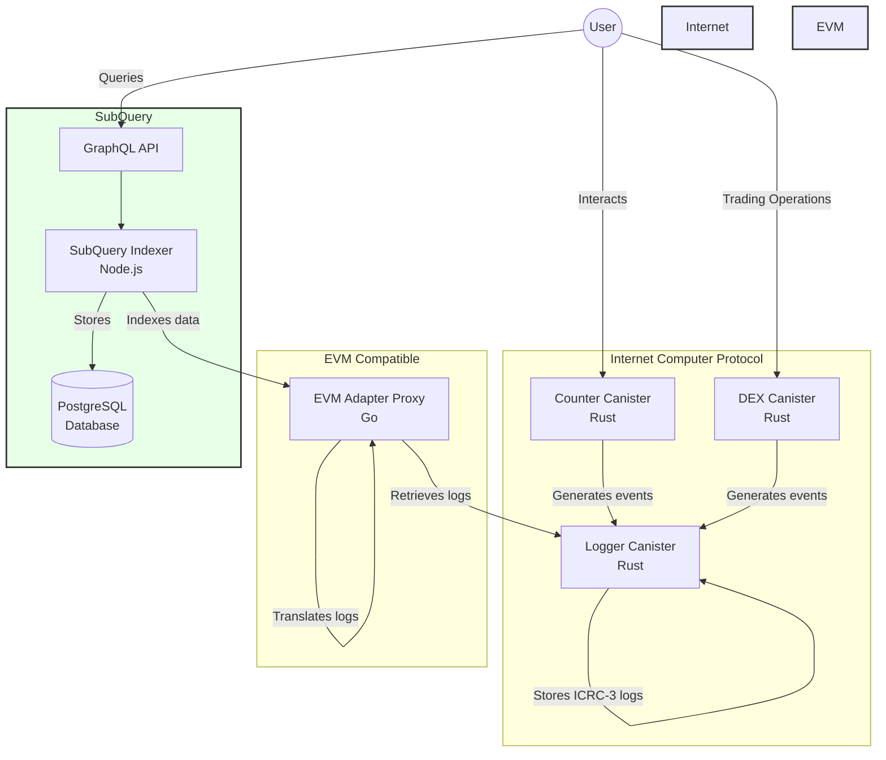

# Project Modules Architecture

```mermaid
graph TD
    User((User))
    CC[Counter Canister<br>Rust]
    DC[DEX Canister<br>Rust]
    LC[Logger Canister<br>Rust]
    EAP[EVM Adapter Proxy<br>Go]
    SQI[SubQuery Indexer<br>Node.js]
    DB[(PostgreSQL<br>Database)]
    GQL[GraphQL API]

    User --> |Interacts| CC
    User --> |Trading Operations| DC
    CC --> |Generates events| LC
    DC --> |Generates events| LC
    LC --> |Stores ICRC-3 logs| LC
    EAP --> |Retrieves logs| LC
    EAP --> |Translates logs| EAP
    SQI --> |Indexes data| EAP
    SQI --> |Stores| DB
    User --> |Queries| GQL
    GQL --> SQI

    subgraph Internet Computer Protocol
        CC
        DC
        LC
    end

    subgraph EVM Compatible
        EAP
    end

    subgraph SubQuery
        SQI
        DB
        GQL
    end

    style Internet Computer Protocol fill:#f0f0f0,stroke:#333,stroke-width:2px
    style EVM Compatible fill:#e6f3ff,stroke:#333,stroke-width:2px
    style SubQuery fill:#e6ffe6,stroke:#333,stroke-width:2px
```
